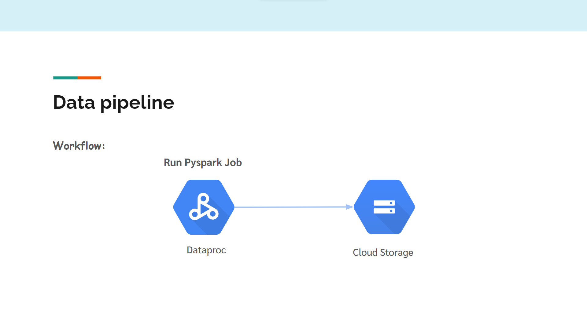
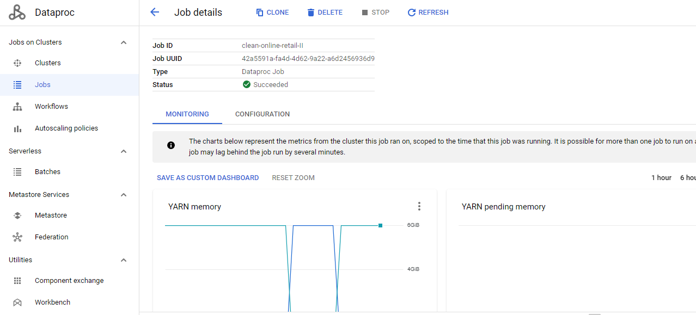

# Simple Pipeline with Pyspark on Dataproc
The purpose of the project is to learn how to use commands in pyspark library and run the job on Dataproc.

## What are we going to do
We're going to get data from UC Irvine Machine Learning Repository, clean it with pyspark and save it in Cloud Storage Bucket.

## Link dataset
https://archive-beta.ics.uci.edu/ml/datasets/online+retail+ii   

Note: You can find information about the dataset in the link.

## Workflow

## How to do this
Note: To do this you need access to a project that links to Billing Account. (There is Free Trial if you're new to Google Cloud)
 

***(In Cloud Storage)***  
**Step 1:** Create Cloud Storage bucket [follow the official steps here](https://cloud.google.com/storage/docs/creating-buckets)  

**Step 2:** Upload folder data and etl.py from this repo to the bucket (Don't forget to change BUCKET_NAME in etl.py)  

**Step 3:** Create folder output in the bucket  

***(In Dataproc)***  
**Step 3:** Create cluster [follow the official steps here](https://cloud.google.com/dataproc/docs/guides/create-cluster)  

<u>Tip!</u> For Cluster type choose Single Node (1 master, 0 workers) because it doesn't require a master-worker cluster to complete the job.

**Step 4:** Submit job to your cluster  

**Step 5:** Point your browser to Job details page on Dataproc  
It should look like this

and check you result in Cloud Storage Bucket

All DONE!!!